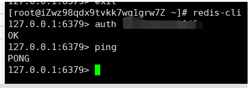

# 安装 Redis

# Windows
一、下载 Redis 安装程序

文件已分享到百度网盘，链接：https://pan.baidu.com/s/1XdjU4aHUGYBn6v4eCLiLUg 提取码：60cj

二、解压压缩文件，运行文件夹中的 redis-server.exe 应用程序
三、另一个安装应用程序无脑下一步就好了


# Liunx
## RedHat
```
// 安装
yum install redis

// 启动 redis 服务器
systemctl start redis.service

// 查看 redis 服务器的运行状态
systemctl status redis.service

// 开机启动 redis 服务器
systemctl enable redis.service

// 开机禁用 redis 服务器
systemctl disable redis.service
```

### 允许远程访问
编辑配置文件
```
vi /etc/redis.conf
```

    注释掉这一行
    #bind 127.0.0.1

    取消注释这一行
    #requirepass foobared
    修改为
    requirepass <your password>

修改完配置文件后重启服务

### 连接
没有设置密码直接输入 redis-cli 即可

#### 测试
使用 ping  


redis 客户端连接成功，但是操作报异常
```
(error) NOAUTH Authentication required.
```
错误的含义是说你没有认证，说明没有使用密码连接

设置了密码有两种连接方式
1. 直接输入 redis-cli -h 127.0.0.1 -p 6379 -a yourPassword

2. 先输入 redis-cli  
然后输入 auth yourPassword

## Ubuntn 
```
// 安装
apt-get install redis-server

// 启动
redis-server

// 查看状态
redis-cli
```

